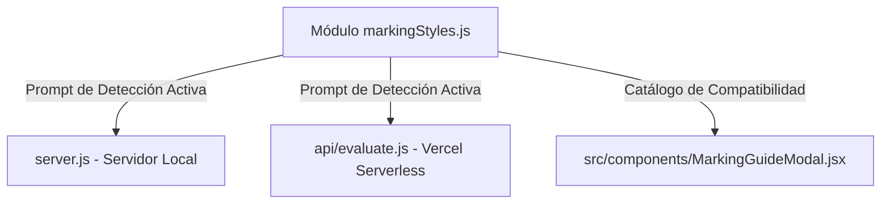

# 📝 Bitácora de Corrección de Errores y Registro de Cambios — EvaluaIA

**Fecha**: 18 de junio de 2026  
**Desarrollador**: Antigravity (AI Coding Assistant)  
**Objetivo**: Registro de Errores Encontrados y Soluciones de Arquitectura Implementadas  
**Repositorio**: EvaluaIA Simple (`c:\Users\User\AppData\Roaming\npm\evalua-ia-simple`)  

---

## 🔍 1. Errores Identificados y Corregidos (Historial Reciente)

En fases anteriores de desarrollo y pruebas se detectaron varios fallos críticos en el comportamiento de la aplicación tanto localmente como en el despliegue de Vercel. A continuación, se detallan los diagnósticos y soluciones aplicadas:

### A. Bug de la Cámara en Vercel (Captura Inactiva)
* **Error**: Al presionar el botón para tomar la foto dentro de la aplicación desplegada en Vercel, la cámara se activaba pero la captura fallaba silenciosamente y la foto no se subía al backend.
* **Causa**: El componente `ImageUploader.jsx` intentaba procesar la imagen capturada llamando a una función `compressImage()`, la cual no existía en el alcance o no estaba importada correctamente en ese módulo.
* **Solución**: Se actualizó `ImageUploader.jsx` para importar y utilizar la función helper de compresión de imágenes `compressImageForUpload()` exportada desde `nvidiaApi.js`. Esto procesa el canvas de la cámara y reduce el tamaño de la imagen en base64 antes de transmitirla.

### B. Bloqueo de Acceso a la Cámara (Permissions Policy)
* **Error**: En el servidor de producción Vercel y local seguro, el navegador bloqueaba el acceso de hardware de la cámara con el mensaje "Permission Denied".
* **Causa**: En el archivo `server.js`, la cabecera HTTP de política de permisos (`Permissions-Policy`) estaba mal configurada como `camera=()`, lo que deshabilitaba de raíz el uso de la cámara por razones de seguridad excesiva.
* **Solución**: Se modificó la directiva a `camera=(self)`, permitiendo el acceso del hardware de la cámara de manera exclusiva al dominio actual de la aplicación, manteniendo bloqueados otros sensores inseguros (micrófono, geolocalización).

### C. Fallo en el Parser JSON y Respuestas Correctas Evaluadas Incorrectas
* **Error**: El modelo de IA (`meta/llama-3.2-90b-vision-instruct`) a veces emitía JSON con marcas Markdown extras, o devolvía comentarios indicando que una respuesta era correcta, pero el booleano `"correcta"` se guardaba como `false` en la base de datos o pantalla.
* **Causa**: 
  1. La IA a veces respondía con formatos variados de texto (ej. `"correcta": "True"`, `"correcta": "sí"`, `"correcta": 1`, `"correcta": "correcto"`) en lugar de un booleano estricto `true`.
  2. El parser de JSON local era muy frágil ante respuestas de la IA envueltas en bloques Markdown (```json...```) o con textos informales adyacentes.
  3. La sanitización de cadenas sobre-escapaba comillas simples, dobles y barras inclinadas, rompiendo la coherencia de los comentarios.
* **Solución**:
  1. Se implementó la función `parseCorrectaField(value)` que normaliza y convierte múltiples formatos (`"true"`, `"verdadero"`, `"sí"`, `"si"`, `"correcto"`, `"1"`, `1`) a booleano estricto `true` en el backend.
  2. Se creó un extractor de JSON robusto `extractJSON(content)` que maneja bloques Markdown y busca de forma balanceada llaves `{}` en el texto si la IA añade explicaciones fuera de la estructura.
  3. Se sincronizó esta lógica robusta de parseo y sanitización en ambos endpoints: el local de Node.js (`server.js`) y la serverless function de Vercel (`api/evaluate.js`).
  4. Se actualizó el componente del frontend `EvaluationResult.jsx` para evaluar la corrección usando la misma lógica de tolerancia.

---

## 🎨 2. Nuevos Cambios: Base de Datos de 50 Formas de Marcación

Para resolver el problema donde el modelo visual de la IA malinterpretaba la selección física de los alumnos en exámenes tradicionales (por ejemplo, interpretando un subrayado o descarte invertido como respuesta inválida), se añadieron las siguientes mejoras:

### A. Módulo Centralizado de Estilos de Marcación
* **Ubicación**: [`api/markingStyles.js`](file:///c:/Users/User/AppData/Roaming/npm/evalua-ia-simple/api/markingStyles.js)
* **Qué incluye**:
  - Un listado estructurado de **50 estilos de marcación de exámenes** con nombre, descripción, análisis de riesgos y recomendación.
  - Clasificación en niveles de compatibilidad: **Alta** (óvalos rellenos, X limpia), **Media** (subrayados, flechas, marcas tenues) y **Baja** (descarte invertido, marcas dobles tachadas, manchones).
  - El string `markingStylesPrompt` que inyecta instrucciones exhaustivas en el prompt de la IA explicándole cómo discernir la intención real del alumno frente a estas 50 marcas para evitar falsos negativos.



### B. Sincronización del Prompt en los Backends
* Se modificaron los archivos [`server.js`](file:///c:/Users/User/AppData/Roaming/npm/evalua-ia-simple/server.js) y [`api/evaluate.js`](file:///c:/Users/User/AppData/Roaming/npm/evalua-ia-simple/api/evaluate.js) para importar el prompt de estilos e inyectarlo en el rol de sistema (`system`) enviado a NVIDIA.
* Esto fuerza a la IA a describir detalladamente en el campo `"razonamiento_visual"` el estilo de marca detectado, dándole transparencia absoluta a las correcciones.

### C. Modal Interactivo y Educativo
* **Ubicación**: [`src/components/MarkingGuideModal.jsx`](file:///c:/Users/User/AppData/Roaming/npm/evalua-ia-simple/src/components/MarkingGuideModal.jsx)
* **Qué incluye**:
  - Visualización ordenada de las 50 marcas del catálogo con sus respectivos riesgos y consejos para el aula.
  - Filtros interactivos por nivel de riesgo y categoría de marca.
  - Buscador reactivo para encontrar estilos de marcación al instante.
  - Animaciones fluidas mediante `framer-motion` integradas a la UI glassmorphic.

### D. Botón de Navegación del Usuario
* Se modificó [`src/App.jsx`](file:///c:/Users/User/AppData/Roaming/npm/evalua-ia-simple/src/App.jsx) añadiendo el botón de acceso **"Guía de Marcación"** en el Header, utilizando el icono `BookOpen`.

---

## 📊 3. Registro de Archivos Modificados

| Tipo de Cambio | Ruta del Archivo | Descripción de la Modificación |
| :--- | :--- | :--- |
| **NUEVO** | [markingStyles.js](file:///c:/Users/User/AppData/Roaming/npm/evalua-ia-simple/api/markingStyles.js) | Base de datos de 50 marcas de examen y prompt para la IA. |
| **NUEVO** | [MarkingGuideModal.jsx](file:///c:/Users/User/AppData/Roaming/npm/evalua-ia-simple/src/components/MarkingGuideModal.jsx) | Modal interactivo para visualizar y buscar compatibilidades de marcas. |
| **MODIFICADO** | [server.js](file:///c:/Users/User/AppData/Roaming/npm/evalua-ia-simple/server.js) | Inyección del prompt de marcas en el Express backend local. |
| **MODIFICADO** | [evaluate.js](file:///c:/Users/User/AppData/Roaming/npm/evalua-ia-simple/api/evaluate.js) | Inyección del prompt de marcas en el endpoint de Vercel. |
| **MODIFICADO** | [App.jsx](file:///c:/Users/User/AppData/Roaming/npm/evalua-ia-simple/src/App.jsx) | Integración del botón de control para desplegar el modal. |

---

## 🚀 4. Estado del Despliegue

La compilación y validación local de la aplicación en React se completaron sin fallos mediante `npm run build`. Posteriormente, los cambios se desplegaron y aplicaron satisfactoriamente en producción:

* 🌐 **Enlace del Proyecto Actualizado**: [https://evalua-ia-simple.vercel.app](https://evalua-ia-simple.vercel.app)
